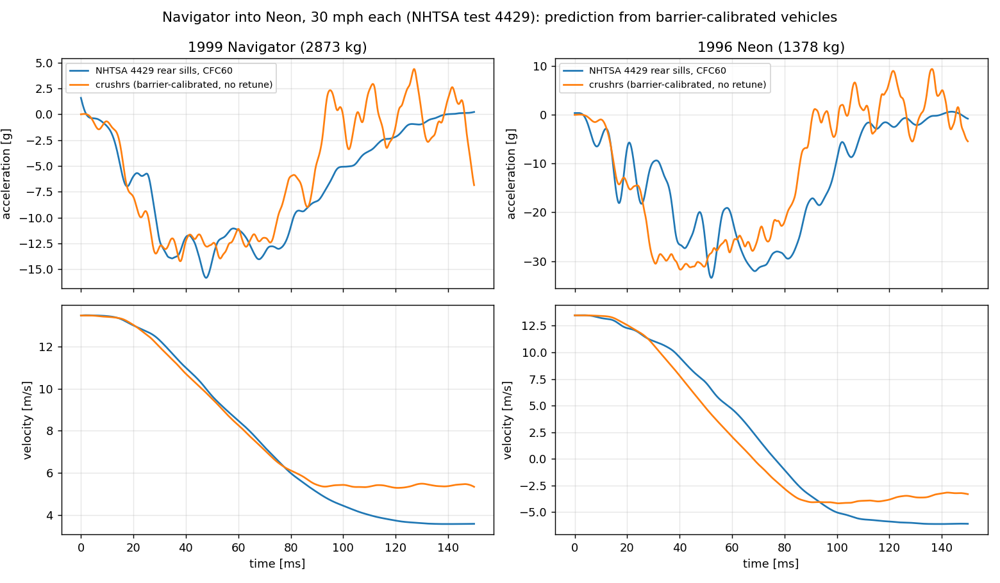

# crushrs

A fast explicit crash solver for estimating **delta-v** (the velocity change
each vehicle experiences) in vehicle-to-vehicle impacts, given initial
velocities and vehicle types.

Vehicles are homogenised crushable blocks of one-point hexahedral elements
with a corotational **honeycomb** material (normal stresses capped at the crush
strength in the element's own axes, hardening on compaction). Each block is
calibrated so a simulated 35 mph NCAP rigid-barrier test reproduces the
vehicle's published NHTSA **KW400** stiffness and implied dynamic crush. The
element kernel runs eight elements per AVX2 lane in f32; a 1290-element
head-on crash takes about 0.2 s.

```bash
cargo run --release -- crash 30 30 --gif crash.gif          # Silverado vs Neon head-on
cargo run --release -- tbone 30 0 -1.2 --vtk out/tbone      # Silverado into the Neon's side
cargo run --release -- headon neon neon 35 35 --history out/nn   # any two vehicles, optional --offset
cargo run --release -- headon navigator neon-pulse 30.14 30.14 --mass-b 1378 \
    --pulse-a data/nhtsa/v04429tsv.179,data/nhtsa/v04429tsv.182 \
    --pulse-b data/nhtsa/v04429tsv.089,data/nhtsa/v04429tsv.092 [--calibrate-rail-boxes 12]   # vs a measured car-to-car test
cargo run --release -- barrier neon                         # NCAP barrier test vs NHTSA KW400 targets
cargo run --release -- barrier neon-pulse --pulse data/nhtsa/v02320tsv.078   # vs the measured NCAP pulse
cargo run --release -- rearend silverado vehicles/neon_1996.toml 35 0   # A's front into B's rear (B needs a rear curve)
cargo run --release -- tune vehicles/specs/neon_1996.toml -o vehicles/neon_1996.toml   # NHTSA test channels -> tuned vehicle TOML
cargo run --release -- run examples/crash_impact.toml       # any TOML setup (writes out/crash.*.parquet)
```

Anywhere a command takes a vehicle name it also takes a vehicle `.toml`
(`vehicles/*.toml`, written by `tune` or by `vehicle <preset>`).

```
2007 Silverado 2622 kg @ +30 mph  vs  1996 Neon 1354 kg @ -30 mph
1290 elements, 644 steps, 187ms (forces 110ms, contact 7ms)
               delta-v              crush   (perfectly plastic limit)
Silverado    -9.71 m/s  -21.7 mph    518 mm   (-9.13 m/s)
Neon        +18.81 m/s  +42.1 mph   1093 mm   (+17.69 m/s)
```

## What it models

- **Elements:** 8-node hexahedra, one-point (mean-strain) integration with an
  exact rank-12 hourglass stabilisation that is zero on any uniform strain or
  rigid rotation (`element.rs`). Inverted elements are eroded.
- **Materials** (`material.rs`): honeycomb (rate form, no eigen-solve — the
  SIMD kernel model) with bilinear or tabulated yield-vs-compaction
  (`curve = [[c, σ], ...]`, up to 8 knots, plus `densification = [c_lock,
  k_lock]` lock-up); only compression compacts. Isotropic crushable foam and
  J2 metal plasticity (finite-strain Hencky, reference models, scalar
  kernel); linear elastic.
- **Contact:** node-to-face penalty on quad face sets, two-way pairs (half
  stiffness per side). Penalty per node = the axial stiffness of the
  material behind it (`E·A_node/h`), limited to `0.1·m_node/dt²` (soft
  constraint) and to a force of `m_node·10⁵ m/s²`; both diagonal splits of
  a warped quad are tested with a wide edge tolerance. Fully crushed
  elements are never eroded: selective mass scaling (`mass_scaling`, default
  0.25 of the initial stable step) keeps the time step from collapsing.
- **Explicit integration:** central difference, per-element stability
  limit `f(ν)·L/c_d` re-evaluated as elements crush; f32 lane kernel
  (`kernel_simd.rs`) with runtime AVX2 dispatch, scalar f64 reference kernel
  (`kernel.rs`). Do **not** build with `-C target-cpu=native`: the AVX-512
  code LLVM emits for the lane kernel is several times slower.
- **Vehicles** (`vehicle.rs`): NCAP KW400 + CRASH3 A/B class coefficients set
  a bilinear force–crush curve; `calibrate` tunes the material so the
  *simulated* barrier test matches. Pre-tuned: 1996 Dodge Neon (front and
  side), 2007 Chevrolet Silverado (front). Element size 0.3 m; re-run
  `barrier <vehicle>-raw --calibrate 14` for another size. Every vehicle
  stands on a rigid **road** 0.15 m below its underbody (contact on the
  `<name>_bottom` faces), in the barrier test and in impacts.
- **Rail box** (`RailBox`, part `<name>_rails`): the frame rails and engine
  carry most of the force, the fenders, hood and grille around them almost
  none. A pulse vehicle's crush zone can carry a box (`width`, `z_range`,
  `force_fraction`) whose elements take that fraction of the force–crush
  curve over their own area and the skin the rest — modulus, yield and
  density scaled alike, so both have the same wave speed and the same
  strain history against a flat wall, and the barrier calibration is
  untouched; the bumper plate over the box is stiffened the same way and
  the contact penalty follows it node by node. A partner that overlaps
  only part of the face sees the concentrated load. `calibrate_rail_boxes`
  fits both vehicles' boxes to a measured car-to-car test (below).

| Vehicle | Test mass | NHTSA KW400 | Simulated | Crush sim / target |
|---|---|---|---|---|
| 1996 Dodge Neon | 1354 kg | 1251 N/mm | 1276 N/mm | 540 / 527 mm |
| 2007 Chevrolet Silverado | 2622 kg | 2550 N/mm | 2561 N/mm | 542 / 513 mm |

Side impacts use `Vehicle::side_profile()` (the block turned 90° with a side
crush curve from FMVSS 214 barrier-test coefficients); rear-ends use
`Vehicle::rear_profile()` the same way (`rearend a b mph_a mph_b`: A's front
into B's rear, both heading the same way, on the road). `tbone` runs on the
road too; for the Silverado into the Neon's side it changes nothing (the
truck's face sits inside the car's long side, so no tilting moment
develops), unlike the frontal case.

### Tuning a vehicle from its NHTSA tests

`tune` runs every calibration from one spec that names the vehicle's
dimensions and its NHTSA test channels (`vehicles/specs/neon_1996.toml`;
format in `src/tune.rs`), and writes a vehicle TOML the impact commands
load by path. Nothing in it needs a second vehicle or a published summary
number — it fits the test signals:

1. **Frontal** — the rear-seat (or sill) X channel(s) of the NCAP
   rigid-barrier test: `calibrate_pulse` builds a crush zone + body with a
   7-knot force–crush table and fits it to the measured velocity history
   (pattern search, 18 barrier runs per round in parallel).
2. **Side** — FMVSS 214 MDB-test coefficients set the side curve and the
   block turned 90° is calibrated to it (`side_profile`).
3. **Rear** — CRASH3 rear coefficients (`[rear] a, b` in kg/cm, kg/cm²)
   set the rear curve, calibrated the same way (`rear_profile`). No sourced
   rear coefficients are in the repo yet; without them `rearend` refuses.
4. **Rail box** — where the force goes on the face, from the frontal
   test's **load-cell wall** when it has one (one channel per cell; the box
   is the central span that holds 80 % of the force laterally and
   vertically), else from a published average height of force, else given
   explicitly.

For the Neon that is two minutes on two cores:

```
frontal pulse (test 2320): peak -31.0 vs -35.2 g, crush 758 vs 740 mm at 76 vs 78 ms, e 0.135 vs 0.163, rms 5.88 g, Δv 17.67 vs 17.65 m/s
side: KW150 8302 vs 7632 N/mm, crush 241 vs 282 mm, e 0.135
rail box as given: 0.45 m wide, z 0.06–0.41 m, 80 % of the force
```

and the result predicts the car-to-car test below as well as the hand-built
preset (Δv 9.65 / 19.71 vs measured 9.89 / 19.57 m/s). `vehicles/` holds the
tuned files and `vehicles/specs/` the specs. Side and rear are the two
stages still driven by coefficients rather than channels; with the side
MDB and FMVSS 301 rear test pulses they become pulse fits like the frontal.

On KW400: NHTSA's published stiffness is the wall force integrated over
25–400 mm of crush, and it is about twice what the rear-seat channel
integrates to over the same crush (575 vs 1251 N/mm for the Neon) — the
cabin does not feel the front's force until the plastic wave arrives. The
pipeline fits the channel, not the number; a vehicle with load-cell wall
channels can be fitted to the wall force directly, which is the next stage
to add. NHTSA's servers are not reachable from the build sandbox, so the
spec names channel files you have exported.

### Calibrating to a measured pulse

`barrier <vehicle> --pulse <nhtsa tsv> [--calibrate N]` compares the
simulated rear-seat accelerometer with a measured NHTSA channel (CFC 60
both, velocity and crush by integration) and, with `--calibrate`, fits the
vehicle to it: a 7-knot force–crush table for the crush zone (+ lock-up),
crush-zone and body moduli, by pattern search on a velocity-history
objective (~15 barrier runs per round). `neon-pulse` is the 1996 Neon fitted
to NHTSA test 2320 (`data/nhtsa/`): a 1.5 m crush zone of 0.1 m elements and
190 kg ahead of an elastic body, so the plastic wave reaches the cabin fast
enough. Measured vs simulated: Δv 17.65 vs 17.4–17.6 m/s, peak −35 vs −33 g,
max crush 736 vs 800 mm at 78 vs 84 ms, restitution 0.17 vs 0.10–0.13
(rebound scatters ±0.3 m/s run to run: the lock-up front is chaotic).


The pulse vehicle carries a thin stiff elastic **bumper layer** (`bumper =
[0.1 m, 25 kg, 300 MPa]`, part `<name>_bumper`) ahead of the honeycomb: it
spreads nodal contact loads like a bumper beam, so two soft fronts meet as
two stiff faces. Without it two `neon-pulse` fronts dimple and interlock
each other under node-to-face contact. Nose-to-nose `headon neon-pulse
neon-pulse 35 35` gives Δv 16.8 m/s each, 34 g, 776 mm crush, e = 0.08 (the
symmetric case is the barrier test: measured Δv 17.65 m/s, e = 0.17; with
uniform faces, `--no-rail-box`, 17.5 m/s and e = 0.12 — the two rail boxes
meeting pitch both cars a little, which costs rebound), and 45 vs 25 mph
gives the same Δv, as it must.


### Validation: Navigator into Neon (NHTSA test 4429)

`headon navigator neon-pulse 30.14 30.14 --mass-b 1378 --pulse-a
data/nhtsa/v04429tsv.179,data/nhtsa/v04429tsv.182 --pulse-b
data/nhtsa/v04429tsv.089,data/nhtsa/v04429tsv.092` runs the real car-to-car
test (2873 kg Navigator into the 1378 kg Neon, 30 mph each) with vehicles
calibrated on rigid-barrier tests — the Expedition/Navigator on test 3124
at the same speed, the Neon on test 2320 at a different speed — and
compares the rear accelerometers.



|  | Navigator Δv at 150 ms | Neon Δv | peaks (CFC 60) | J |
|---|---|---|---|---|
| measured | 9.9 m/s | 19.6 m/s | −15.8 / −33.4 g | |
| uniform faces, free in space (`--no-rail-box --no-ground`) | 8.1 | 16.8 | −14.2 / −31.8 | 6.20 |
| uniform faces on the road (`--no-rail-box`), blind | 9.3 | 20.4 | −14.2 / −31.8 | 3.43 |
| rail boxes on the road (default), fitted | 9.7 | 19.5 | −15.4 / −34.2 | 2.88 |

`J` is the summed pulse objective (velocity RMS + end error + 0.1 × CFC 60
RMS, m/s, for both cars). What was wrong before was not the faces: a free
block has nothing to stop its nose from diving, so the taller Navigator's
face tilted and pushed the Neon's front down at 10 m/s and under itself,
and the collision "ended" with the two still approaching (e < 0). On the
road the Neon bottoms out after its ground clearance and the whole late
phase (80–150 ms) falls into place, with no fitting at all: the blind
prediction is within 0.6 and 0.8 m/s of the measured Δv.

The rail boxes are then fitted to this test with `--calibrate-rail-boxes
12` (`headon.rs`): differential evolution over the eight box parameters
(width, height band, force fraction per vehicle) on the summed pulse
objective, ~160 impact runs, a global method because the box snaps to the
element grid and the lock-up front is chaotic. It found the frame rails:
the Navigator's box is 1.25 m wide at 0.15–0.72 m carrying 75 % of the
force, the Neon's 0.45 m wide at 0.06–0.41 m carrying 80 % — both low in
the face, where the average height of force of every measured vehicle
lies. The search is bounded there on purpose: unconstrained, the fit was
happy to put the Neon's stiffness in its cowl row (the SUV overriding it),
which pitches the block nose-up against a barrier and is nothing a
load-cell wall would ever show. With the boxes the barrier pulses stay
matched (Neon −33.8 g, 764 mm; Expedition 657 mm) except for restitution,
which the off-centre load line shifts by ±0.05 as the block pitches onto
the road. With one test and eight parameters this is a fit, not a
validation; the blind row above is the honest number, and a load-cell wall
(AHOF) record per vehicle is what would pin each box down on its own.

What remains in the Neon's pulse — a soft first 35 ms in the test (−10 g
where the model gives −30 g) — is the height mismatch at the interface:
the Navigator's rails ride above the Neon's and meet its hood and
radiator support first. At 0.3 m elements the boxes are one or two rows
tall; `--element-size 0.15` resolves the bands properly (the pulse
vehicles are transverse-grid insensitive at that size) at 4× the run time,
and is where the fit should be repeated next.

What a homogenised block cannot do: the real car decelerates the cabin
within 3 ms through stiff rails while the engine mass is still free; the
block needs ~10 ms for its plastic wave.

## Inputs and outputs

- **TOML** setup (`input/config.rs` has the full schema): generated blocks or
  an Abaqus `.inp` mesh (Gmsh export: C3D8 hexahedra, CPS4 contact faces,
  NSET), materials per part, initial velocities, fixed sets, contact pairs,
  solver settings.
- **VTK:** binary `.vtu` per frame + `.pvd` time series (ParaView, VisIt,
  PyVista, meshio). Point data: displacement. Cell data: plastic strain /
  compaction, stress, part, eroded.
- **History (the binout):** `--history out/run` (or `output.history` in
  TOML) writes Parquet tables sampled every `history_steps` steps (1 =
  every step, i.e. ~10–50 kHz here):
  - `out/run.nodes.parquet` — accelerometer samples: `time, step,
    accelerometer, node`, position `x y z`, and displacement / velocity /
    acceleration in global axes (`ux.. vx.. ax..`) and in the
    accelerometer's body-fixed frame (`lux.. lvx.. lax..`).
  - `out/run.frames.parquet` — each accelerometer's frame at each sample:
    origin `ox oy oz` and the local unit axes in global components
    (`ex_x ex_y ex_z`, `ey_*`, `ez_*`), so any global quantity can be
    re-expressed locally afterwards.
  - `out/run.parts.parquet` — per-part mass-weighted mean displacement,
    velocity, acceleration (net force / mass) and kinetic energy.

  `--pulse` runs also write `<base>.pulse.parquet` (measured vs simulated
  acceleration, velocity, crush on one time grid); `headon --pulse-a
  --pulse-b` writes `<base>.pulse_a/b.parquet`, which
  `examples/plot_headon_pulses.py` plots.

  Accelerometers work like LS-DYNA's `*ELEMENT_SEATBELT_ACCELEROMETER`: a
  frame is three nodes (origin, +x node, node in the x–y plane) re-evaluated
  from the deformed mesh, so it rotates with the body. `at = [x, y, z]` picks
  the part node nearest a point and builds the frame from its neighbours
  (local axes start parallel to global); `nodes = [...]` / `set = "..."`
  plus `frame = { origin, x_axis, plane }` give full control. The `crash`,
  `tbone` and `barrier` commands add a rear-seat accelerometer per vehicle.
  The time step is adaptive, so `time` is not uniformly spaced — resample
  before filtering (e.g. to 10 kHz, then CFC60 for NCAP comparisons).

  ```python
  import pandas as pd
  n = pd.read_parquet("out/run.nodes.parquet")
  neon = n[n.accelerometer == "neon_rear"].set_index("time")
  neon.lax.plot()          # longitudinal acceleration in the car's own frame
  ```
- **GIF:** built-in software renderer coloured by plastic strain.

## Caveats

- Homogenised blocks reproduce the *energy and stiffness* of a real front
  (hence delta-v), not the crush *shape*; peak forces are ~2× real because
  crush localises harder than real folding.
- The f32 kernel's precision floor is the stress increment `E·Δε` resolved to
  f32 epsilon (≈ E·6e-8 per step): fine for these materials (the caps bound
  it), but a material with a much smaller yield/E ratio would want f64.
- Calibrated parameters are tied to the element size they were tuned at.

## Sources

- NHTSA DOT HS 811 293 (Neon / Silverado KW400), NHTSA ESV 09-0416
- Vehicle frontal crush stiffness coefficient trends (CRASH3 A/B by class)
- Crush Energy and Stiffness in Side Impacts (FMVSS 214 side coefficients)
