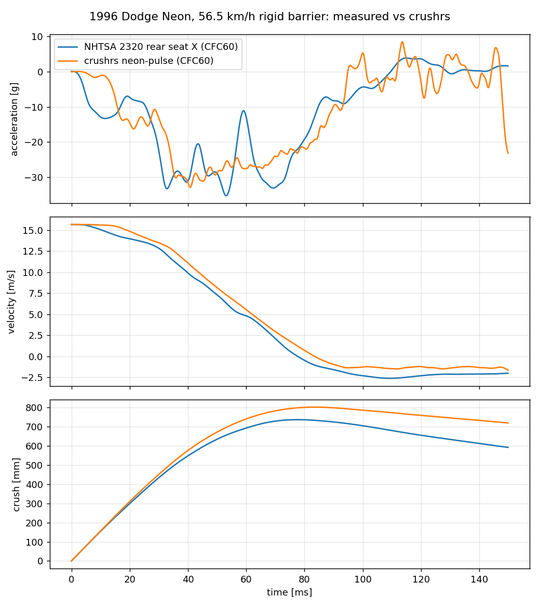

# crushrs

A fast explicit crash solver for estimating **delta-v** (the velocity change
each vehicle experiences) in vehicle-to-vehicle impacts, given initial
velocities and vehicle types.

Vehicles are homogenised crushable blocks of one-point hexahedral elements
with a corotational **honeycomb** material (normal stresses capped at the crush
strength in the element's own axes, hardening on compaction). Each block is
calibrated so a simulated 35 mph NCAP rigid-barrier test reproduces the
vehicle's published NHTSA **KW400** stiffness and implied dynamic crush. The
element kernel runs eight elements per AVX2 lane in f32; a 1290-element
head-on crash takes about 0.2 s.

```bash
cargo run --release -- crash 30 30 --gif crash.gif          # Silverado vs Neon head-on
cargo run --release -- tbone 30 0 -1.2 --vtk out/tbone      # Silverado into the Neon's side
cargo run --release -- headon neon neon 35 35 --history out/nn   # any two vehicles, optional --offset
cargo run --release -- barrier neon                         # NCAP barrier test vs NHTSA KW400 targets
cargo run --release -- barrier neon-pulse --pulse data/nhtsa/v02320tsv.078   # vs the measured NCAP pulse
cargo run --release -- run examples/crash_impact.toml       # any TOML setup (writes out/crash.*.parquet)
```

```
2007 Silverado 2622 kg @ +30 mph  vs  1996 Neon 1354 kg @ -30 mph
1290 elements, 644 steps, 187ms (forces 110ms, contact 7ms)
               delta-v              crush   (perfectly plastic limit)
Silverado    -9.71 m/s  -21.7 mph    518 mm   (-9.13 m/s)
Neon        +18.81 m/s  +42.1 mph   1093 mm   (+17.69 m/s)
```

## What it models

- **Elements:** 8-node hexahedra, one-point (mean-strain) integration with an
  exact rank-12 hourglass stabilisation that is zero on any uniform strain or
  rigid rotation (`element.rs`). Inverted elements are eroded.
- **Materials** (`material.rs`): honeycomb (rate form, no eigen-solve — the
  SIMD kernel model) with bilinear or tabulated yield-vs-compaction
  (`curve = [[c, σ], ...]`, up to 8 knots, plus `densification = [c_lock,
  k_lock]` lock-up); only compression compacts. Isotropic crushable foam and
  J2 metal plasticity (finite-strain Hencky, reference models, scalar
  kernel); linear elastic.
- **Contact:** node-to-face penalty on quad face sets, two-way pairs (half
  stiffness per side). Penalty per node = the axial stiffness of the
  material behind it (`E·A_node/h`), limited to `0.1·m_node/dt²` (soft
  constraint) and to a force of `m_node·10⁵ m/s²`; both diagonal splits of
  a warped quad are tested with a wide edge tolerance. Fully crushed
  elements are never eroded: selective mass scaling (`mass_scaling`, default
  0.25 of the initial stable step) keeps the time step from collapsing.
- **Explicit integration:** central difference, per-element stability
  limit `f(ν)·L/c_d` re-evaluated as elements crush; f32 lane kernel
  (`kernel_simd.rs`) with runtime AVX2 dispatch, scalar f64 reference kernel
  (`kernel.rs`). Do **not** build with `-C target-cpu=native`: the AVX-512
  code LLVM emits for the lane kernel is several times slower.
- **Vehicles** (`vehicle.rs`): NCAP KW400 + CRASH3 A/B class coefficients set
  a bilinear force–crush curve; `calibrate` tunes the material so the
  *simulated* barrier test matches. Pre-tuned: 1996 Dodge Neon (front and
  side), 2007 Chevrolet Silverado (front). Element size 0.3 m; re-run
  `barrier <vehicle>-raw --calibrate 14` for another size.

| Vehicle | Test mass | NHTSA KW400 | Simulated | Crush sim / target |
|---|---|---|---|---|
| 1996 Dodge Neon | 1354 kg | 1251 N/mm | 1276 N/mm | 540 / 527 mm |
| 2007 Chevrolet Silverado | 2622 kg | 2550 N/mm | 2561 N/mm | 542 / 513 mm |

Side impacts use `Vehicle::side_profile()` (the block turned 90° with a side
crush curve from FMVSS 214 barrier-test coefficients).

### Calibrating to a measured pulse

`barrier <vehicle> --pulse <nhtsa tsv> [--calibrate N]` compares the
simulated rear-seat accelerometer with a measured NHTSA channel (CFC 60
both, velocity and crush by integration) and, with `--calibrate`, fits the
vehicle to it: a 7-knot force–crush table for the crush zone (+ lock-up),
crush-zone and body moduli, by pattern search on a velocity-history
objective (~15 barrier runs per round). `neon-pulse` is the 1996 Neon fitted
to NHTSA test 2320 (`data/nhtsa/`): a 1.5 m crush zone of 0.1 m elements and
190 kg ahead of an elastic body, so the plastic wave reaches the cabin fast
enough. Measured vs simulated: Δv 17.65 vs 17.4–17.6 m/s, peak −35 vs −33 g,
max crush 736 vs 800 mm at 78 vs 84 ms, restitution 0.17 vs 0.10–0.13
(rebound scatters ±0.3 m/s run to run: the lock-up front is chaotic).



Nose-to-nose Neon vs Neon at 35 mph (`headon neon neon`) gives Δv 17.2 m/s
each with e ≈ 0.10 — the symmetric case is the barrier test, whose measured
Δv is 17.65 m/s. Two `neon-pulse` vehicles against each other are a known
weak spot: two fine, light honeycomb fronts mangle each other's interface
under node-to-face contact (mass scaling then adds 20–30 % mass); pair the
pulse vehicle with a coarse one, or with the wall.

What a homogenised block cannot do: the real car decelerates the cabin
within 3 ms through stiff rails while the engine mass is still free; the
block needs ~10 ms for its plastic wave. And it stores less recoverable
elastic energy than a real body, so restitution is low by ~0.05.

## Inputs and outputs

- **TOML** setup (`input/config.rs` has the full schema): generated blocks or
  an Abaqus `.inp` mesh (Gmsh export: C3D8 hexahedra, CPS4 contact faces,
  NSET), materials per part, initial velocities, fixed sets, contact pairs,
  solver settings.
- **VTK:** binary `.vtu` per frame + `.pvd` time series (ParaView, VisIt,
  PyVista, meshio). Point data: displacement. Cell data: plastic strain /
  compaction, stress, part, eroded.
- **History (the binout):** `--history out/run` (or `output.history` in
  TOML) writes Parquet tables sampled every `history_steps` steps (1 =
  every step, i.e. ~10–50 kHz here):
  - `out/run.nodes.parquet` — accelerometer samples: `time, step,
    accelerometer, node`, position `x y z`, and displacement / velocity /
    acceleration in global axes (`ux.. vx.. ax..`) and in the
    accelerometer's body-fixed frame (`lux.. lvx.. lax..`).
  - `out/run.frames.parquet` — each accelerometer's frame at each sample:
    origin `ox oy oz` and the local unit axes in global components
    (`ex_x ex_y ex_z`, `ey_*`, `ez_*`), so any global quantity can be
    re-expressed locally afterwards.
  - `out/run.parts.parquet` — per-part mass-weighted mean displacement,
    velocity, acceleration (net force / mass) and kinetic energy.

  `--pulse` runs also write `<base>.pulse.parquet` (measured vs simulated
  acceleration, velocity, crush on one time grid).

  Accelerometers work like LS-DYNA's `*ELEMENT_SEATBELT_ACCELEROMETER`: a
  frame is three nodes (origin, +x node, node in the x–y plane) re-evaluated
  from the deformed mesh, so it rotates with the body. `at = [x, y, z]` picks
  the part node nearest a point and builds the frame from its neighbours
  (local axes start parallel to global); `nodes = [...]` / `set = "..."`
  plus `frame = { origin, x_axis, plane }` give full control. The `crash`,
  `tbone` and `barrier` commands add a rear-seat accelerometer per vehicle.
  The time step is adaptive, so `time` is not uniformly spaced — resample
  before filtering (e.g. to 10 kHz, then CFC60 for NCAP comparisons).

  ```python
  import pandas as pd
  n = pd.read_parquet("out/run.nodes.parquet")
  neon = n[n.accelerometer == "neon_rear"].set_index("time")
  neon.lax.plot()          # longitudinal acceleration in the car's own frame
  ```
- **GIF:** built-in software renderer coloured by plastic strain.

## Caveats

- Homogenised blocks reproduce the *energy and stiffness* of a real front
  (hence delta-v), not the crush *shape*; peak forces are ~2× real because
  crush localises harder than real folding.
- The f32 kernel's precision floor is the stress increment `E·Δε` resolved to
  f32 epsilon (≈ E·6e-8 per step): fine for these materials (the caps bound
  it), but a material with a much smaller yield/E ratio would want f64.
- Calibrated parameters are tied to the element size they were tuned at.

## Sources

- NHTSA DOT HS 811 293 (Neon / Silverado KW400), NHTSA ESV 09-0416
- Vehicle frontal crush stiffness coefficient trends (CRASH3 A/B by class)
- Crush Energy and Stiffness in Side Impacts (FMVSS 214 side coefficients)
